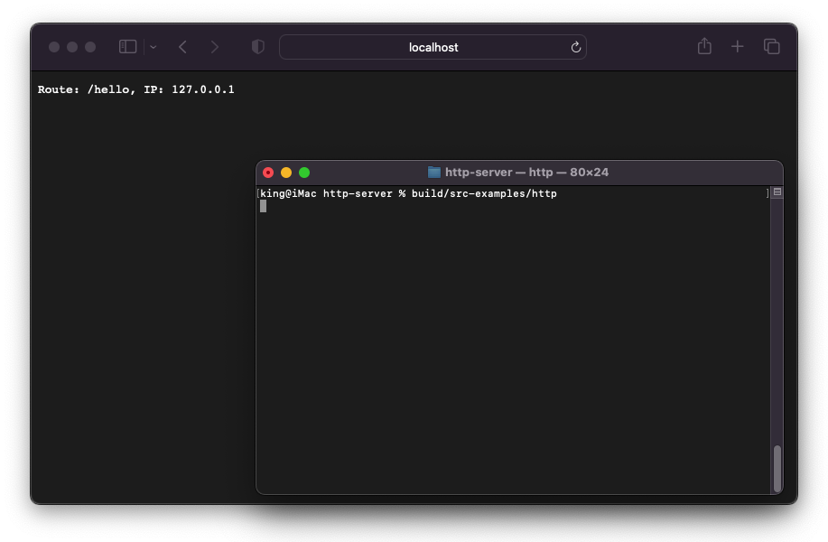

<div align="center">

  # http-server
  A simple HTTP server made using C++.
</div>

## Library Usage Examples
```cpp
#include "HttpServer.hpp"

HttpServer g_Server;
int main(int argc, char* argv[])
{
    g_Server.use("/", HttpMethod::GET, [](HttpRequest request, HttpResponse response) {
        response.setHeader("Content-Type", "text/plain");
        response.send("Hello, world!");
    });

    g_Server.listen(8080);
};
```



## Building
- Install [CMake](https://cmake.org/download)
- Run `build.bat`, or `build.sh` to build this project.
  
If built successfully, a static library with the name `web-server.lib` should be found inside `build/Release` directory.

## Features
- [ ] Caching
- [ ] SSL Support
